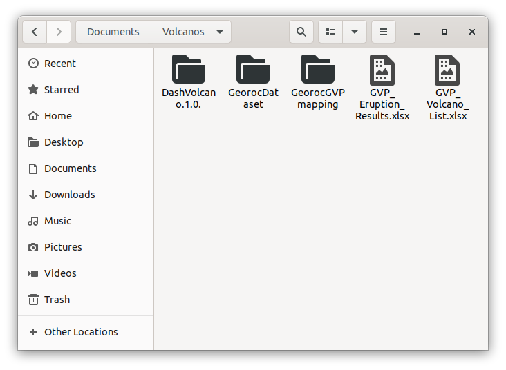
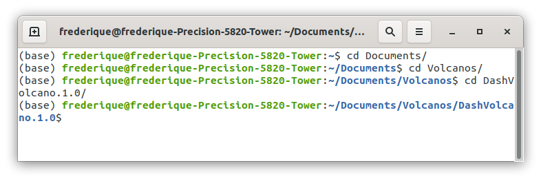
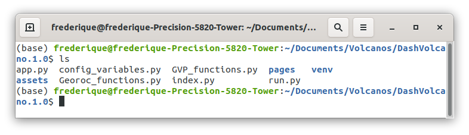
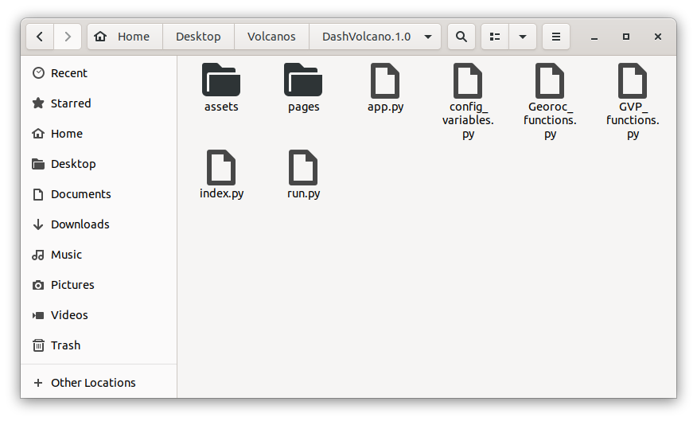
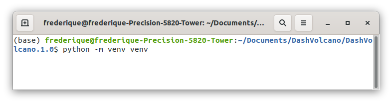
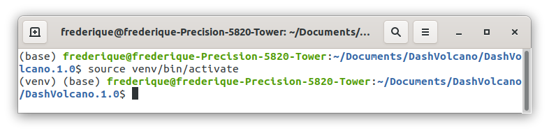
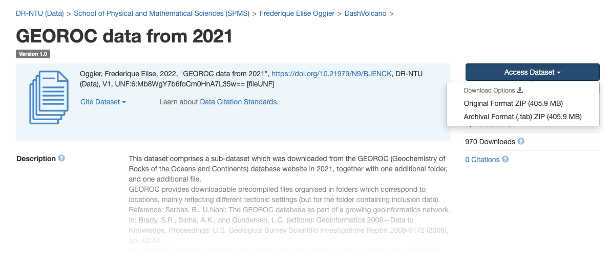

# DashVolcano
This is a project about volcano data analytics, done in collaboration with the Earth Observatory of Singapore (see also <a href= https://researchdata.ntu.edu.sg/dataverse/dashvolcano> here </a>) and the Institut de Physique du Globe de Paris.

DashVolcano is an app, to be downloaded and ran locally on one's computer.
It creates a visual interface, to jointly display volcanic data from two major databases:
(1) the Geochemistry of Rocks of the Oceans and  Continents (GEOROC, https://georoc.eu/georoc/new-start.asp) of the Digital Geochemistry Infrastructure (DIGIS), and 
(2) the Volcanoes of the World (VOTW) of the Smithsonian’s Global Volcanism Program (GVP, https://volcano.si.edu/). 

# 1. Set-up and Directory structure

To install DashVolcano on your computer, the DashVolcano repository should be downloaded from github to your computer. It contains the folders DashVolcano.1.0, GeorocGVPmapping, GeorocDataset and the files GVP_Eruption_Results.xlsx, GVP_Volcano_List.xlsx. The folder DashVolcano could be placed inside the folder Documents of your computer (we will provide an example for this case), or elsewhere (it can be placed anywhere you want, but some adjustement to the example may be needed). 

The resulting directory structure will thus be: 

DashVolcano, containing the 3 folders (DashVolcano.1.0, GeorocGVPmapping, GeorocDataset) and the 2 excel files (GVP_Eruption_Results.xlsx, GVP_Volcano_List.xlsx).

**Example** The folder DashVolcano is placed inside Documents, inside which the 3 folders and the two files are found.

DashVolcano is written in python, you thus need python3 installed on your computer (this should be the case for Mac OS and Linux, instructions are provided for Windows 10 below). 
DashVolcano was tested with: Python 3.7.4 on Ubuntu 20.04.4 LTS, and Python 3.8.3 on Mac OS Monterey version 12.5.1. 
See below for specific instructions for Mac OS and Linux, and for Windows 10.

## 1.1. Set-up: Mac OS and Linux

It is suggested to set up a python virtual environment, to make sure the dependencies are consistent, and to avoid conflicting with possible other existing python set-ups. To do so, open a terminal window, and using the command line in the terminal window, go into the folder DashVolcano.1.0, using the command cd (change directory), the command works as follows, where pathto depends on where you created DashVolcano:

> $ cd pathto/DashVolcano/DashVolcano.1.0.

**Example** In the previous example, the folder DashVolcano/DashVolcano.1.0 was put inside the folder Documents, to go inside the folder DashVolcano.1.0, the command cd is used to go into Dashvolcano.1.0 through Documents, then DashVolcano:

Create the virtual environment: 

> $ python3 -m venv venv

**Example** From within the DashVolcano.1.0 folder, create the virtual environment.

If successful, you will see a new folder named venv inside the folder DashVolcano.1.0:

**Example** Checking that venv was created using the terminal window, using the command ls.

**Example** Checking that venv was created.

Once the virtual python environment is created (this is done only once), it needs to be activated (this is needed every time the terminal window is opened again). This is the command, assuming you used the cd command to be inside the folder DashVolcano.1.0:

> DashVolcano.1.0$ source venv/bin/activate

**Example** Activating the virtual environment: 

You can tell whether the environment is activated by checking before your computer's name:

> (venv) yourname@yourcomputername: 

**Example** The (venv) prefix shows the virtual environment is activated: 

## 1.2. Set-up: Windows

This set-up was tested with Windows 10 and python 3.10.7. 
**Install Python.** Open a command prompt (next to the windows start icon, search for "command prompt" and click on the command prompt icon). Type python. If python is installed, you will see something like that:

> C:\Users\yourusername>python

> Python 3.10.7

Then you can type quit, all set, python is installed.

> quit()

If python is not installed, you need to install it, e.g. you can download the windows installer from  www.python.org. Once you have downloaded the installer and you open it, you will have options for the installation. It is suggested to tick both boxes ("Install launchers for all users" and "Add Python to PATH") and to go for the customize option "Customize installation". Have all the Optional Features ticked, for the Advanced Options, tick (at least) "Install for all users", "Associates files with Python", "Create shortcuts for installed applications", "Add Python to environment variables". Please **pay attention** to where Python is installed, it should look like

> C:\Program Files\Python310

Once done, open again a command prompt and type python, if the installation is successful, you should see python start.

It is suggested to set up a python virtual environment, to make sure the dependencies are consistent, and to avoid conflicting with possible other existing python set-ups. To do so, first install virtualenv through pip (which should be installed). You can check that pip is installed through the command prompt, by asking which version is present:

> C:\Users\yourusername>pip -V

To install virtualenv through pip, in the command prompt, type pip install virtualenv:

> C:\Users\yourusername>pip install virtualenv

You are likely to see a warning of the kind:
WARNING: The script virtualenv.exe is installed in 'C:\Users\yourusername\AppData\Roaming\Python\Python310\Scripts' which is not on PATH.
This is not a problem, however please **pay attention** to the path indicated in this message.

Then using the command prompt, go into the folder DashVolcano.1.0:

> $ cd DashVolcano.1.0.

and create the virtual environment. Note that the first term is the path to the virtualenv.exe script (the same one discussed in the warning above), then the command --python, followed by the path to python (the same one discussed in the installation guide above) followed by venv: 

> C:\Users\yourusername\DashVolcano.1.0.> C:\Users\myusername\AppData\Roaming\Python\Python310\Scripts\virtualenv.exe --python "C:\Program Files\Python310\python.exe" venv

If successful, you will see a new folder named venv inside the folder DashVolcano.1.0.

Once the virtual python environment is created (this is done only once), it needs to be activated (this is needed every time the command prompt is opened again):

> C:\Users\yourusername\DashVolcano.1.0.>.venv\Scripts\activate

You can tell whether the environment is activated by checking before your user name:

> (venv) C:\Users\yourusername\DashVolcano.1.0.>

# 2. Installing Packages

The purpose of creating a virtual environment is so that you can then install specific versions of python packages, which will not interfere with other setups your computer may be using. Also python packages are often updated, and new versions may cause compatibility issues. Specific tested versions of packages will be installed in your virtual environment, to ensure the app runs smoothly.

To install a python package, still being within the DashVolcanon.1.0. folder with the virtual environment activated, the synthax is as follows for Mac OS, Linux and Windows:

> python -m pip install packagename==version

For example, to install the package dash, version 2.0.0, type the following command:

> python -m pip install dash==2.0.0

The following packages are likely to be needed, please install each of them using the same synthax (replace packagename==version by items in the list below, one by one):
* dash==2.0.0
* dash-bootstrap-components==1.0.0
* dash-core-components==2.0.0
* dash-html-components==2.0.0
* flask ==2.0.0
* geopandas==0.10.2
* numpy==1.20.3
* openpyxl==3.0.7
* pandas==1.3.5
* plotly==5.3.1
* werkzeug==2.0.1

If a message appears to suggest to upgrade pip, whether you do it or not should not impact the app.

For the app to run, you need to have the GEOROC data ready, as explained next.

# 3. Downloading the GVP and GEOROC datasets

The GVP data is provided into two excel files: GVP_Eruption_Results.xlsx (Global Volcanism Program, 2013. Volcanoes of the World, v. 4.9.3 (1 Feb 2021 ). Venzke, E (ed.). Smithsonian Institution. Downloaded 19 October 2021), GVP_Volcano_List.xlsx (Global Volcanism Program, 2013. Volcanoes of the World, v. 4.10.3 (15 Oct 2021 ). Venzke, E (ed.). Smithsonian Institution. Downloaded 24 February 2021). There is no need to download further data. 
This data was downloaded from https://volcano.si.edu/ in 2021. GVP data is regularly updated. It is possible to download more recent datasets to update those provided, but the filenames and type (xlsx), as well as their location in the folder structure, have to remain the same. It is also advised to download both volcano and eruption files around the same period, otherwise volcano names may be present in one file and not in the other, which will cause errors when running the app. To download the most recent datasets form GVP, select all the “evidence” criteria from the volcano query search (https://volcano.si.edu/search_volcano.cfm) and select “confirmed eruption” category from the eruption query search (https://volcano.si.edu/search_eruption.cfm).

There are two possibilities for the GEOROC dataset:

**Method 1.**
The folder GeorocDataset downloaded from github contains the GEOROC datasets, as of June 2021, where each folder is zipped (there are too many files to be stored as such on github), they need to be unzipped. 
For more recent precompiled files, please download them directly from the Geochemistry of Rocks of the Oceans and  Continents (GEOROC, https://georoc.eu/georoc/new-start.asp) of the Digital Geochemistry Infrastructure (DIGIS).

**Method 2.** If you prefer to avoid unzipping the folders provided on github, it is possible to download directly the whole dataset from <a href = https://doi.org/10.21979/N9/BJENCK> here </a>, which will result in a single zipped file:

The zipped file should be unzipped, this will give one txt file, called MANIFEST.TXT, and the folder GeorocDataset, which should replace the one obtained from github.

**Example** This is what the GeorocDataset folder content should look like, irrespective of the method used: 

The folder GeorocDataset contains 13 folders (12 folders from GEOROC + 1 folder called ManualDataset) and 1 .csv file called GEOROCaroundGVP.csv. The file GEOROCaroundGVP.csv contains the GEOROC locations which are geographically relevant to GVP volcanoes. 

# 4. Running the app for the first time

So you have downloaded the DashVolcano repository, set-up your python virtual environment and you have the GEOROC dataset. 
To start the app for the first time, make sure you are within the DashVolcano.1.0. folder, that your virtual environment is activated, and type the following command (you need the data to be available before you use the app for the first time, as explained above in, Downloading the GVP and GEOROC datasets):

> python run.py

This is the same command for Mac OS, Linux and Windows.

All required packages that are needed to run the app should have been installed. If a package is still missing, the app will not start, instead an error message will appear, giving the name of the package that is not found. In this case, just install the missing package, whose name is given in the error message, using the same synthax as explained in "Installing Packages" above.

# 5. Running the app

Once the app is set up, only 2 steps are required. From inside the DashVolcano.1.0 folder, activate the virtual environment and launch the app.
For Mac OS and Linux:

> DashVolcano.1.0$ source venv/bin/activate

> DashVolcano.1.0$ python run.py

For Windows 10:

> C:\Users\yourusername\DashVolcano.1.0.>.venv\Scripts\activate

> C:\Users\yourusername\DashVolcano.1.0.> python run.py

Once the app runs successfully, a message appears in the terminal window, something like

> Dash is running on http://127.0.0.1:8050/

and some statistics are displayed, e.g., (the actual numbers may vary, depending on the dates at which the data was downloaded):

Basic Statistics  
Number of GVP volcanoes:  1416  
Number of GVP eruptions (confirmed):  9855  
Number of volcanoes with known eruption(s):  861  
Number of GEOROC volcanoes:  906  
Number of GEOROC volcanoes with eruption data:  649  

To lauch the app, write the url

> http://localhost:8050/

in the browser of your choice (e.g, chrome, firefox, safari).

# 5. Updating the data

The instructions below are for more advanced usages of the app. You can run the app without looking at what comes next.

**I would like to use more recent GEOROC datasets, is it possible?**

Yes it is possible. 
Updated datasets can be downloaded directly from https://georoc.eu/georoc/new-start.asp, where they are grouped by tectonic settings. 

Here is an example:
In the folder GeorocDataset, there is a folder named Complex_Volcanic_Settings_comp. It contains the file ETNA_SICILY.csv, which is, say, the file that you would like to update. On the left menu of  https://georoc.eu/georoc/new-start.asp, choose Locations, then Complex Volcanic Settings,then Download complete precompiled dataset. You will obtain 7 files, whose names contain: CENTRAL-NEW_YORK_KIMBERLITES.csv, OAXACA_MEXICO.csv, ETNA_SICILY.csv, POTIGUAR_BASIN.csv, FINGER_LAKES_FIELD_NEW_YORK.csv, USTICA_ISLAND_ITALY.csv, HYBLEAN_OR_IBLEAN_PLATEAU_SICILY.csv. Each of these files will have a prefix, that serves as an identifier, and also contains a date, e.g. 2022-06-1VOFM5_ETNA_SICILY.csv. Just put 2022-06-1VOFM5_ETNA_SICILY.csv inside Complex_Volcanic_Settings_comp. The app will read the data by ignoring the prefix if there is only version of the file, if there are several files, the most recent should be chosen. 

**I have my own datasets, I would like to add them, is it possible?**

Yes, it is also possible to add more samples with their rock composition, if the desired samples are not (yet) present in the GEOROC dataset. They need to be in the same format as GEOROC format, and put in the ManualDataset folder. The mapping files need to be updated correspondingly (more on this in "Georoc - GVP mapping files" below), so does the file "GEOROCaroundGVP.csv" (more on this in "The file GEOROCaroundGVP file" below). Examples are found in the ManualDataset folder.

**I would like to display GEOROC data for a volcano which is not in the GVP database, is it possible?**

Yes it is possible. You can do it by editing the mapping files manually, more below in the "GEOROC - GVP mapping files" section.

**Georoc - GVP mapping files**

The mapping files are used by the app to link the GVP names with the GEOROC names. 
The GeorocGVPMapping folder contains a .txt file for each .csv in the GeorocDataset folder. Each file is of the form

>GVP;GEOROC

for example, the file ETNA_SICILY.txt contains

>GVP;GEOROC
Etna;ETNA

The first column contains names of GVP volcanoes, the second column contains GEOROC names. More precisely, the GVP name is the name that can be found in the column 'Volcano Name' of the GVP_Volcano_List.xlsx, the second column contains names that appear in the LOCATION or LOCATION column of a precompiled file downloaded from GEOROC. It has to be the same name as that found in between two / / for the LOCATION COLUMN, or the first name before the first comma (if any) in the LOCATION COMMENT.

Here is a more complex example from the file ANATOLIA-IRAN_BELT_-_CENOZOIC_QUATERNARY.txt.

>Samsari Volcanic Center;SAMSARI CALDERA,SAMSARI VOLCANIC CHAIN

Note there is no space before and after the GVP names, or the GEOROC names.

These mapping files have been compiled algorithmically, with manual checks, but these checks are not exhaustive. There are more than 480 .csv files of data, the longitude and latitude ranges come with different levels of precision, and the location names may not always contain the volcano name itself. It is possible to simply append more GEOROC location names if a mapping file is not complete (and similarly to remove possibly inaccurate data).

Say you would like to see the GEOROC data for Bayah Dome, which is not in the list of GVP volcanoes, but you have spotted samples for BAYAH DOME in the GEOROC file named SUNDAR_ARC.csv. Then you can just manually edit the file SUNDA_ARC.txt (it is important to edit the .txt file corresponding to the .csv file in which you saw the data), and add the line
Bayah Dome;BAYAH DOME

Of course no GVP data will be shown for this volcano, since the name "Baya Dome" is not present in the GVP list of volcanoes, but the GEOROC data will be shown.

If you have added data manually in the folder ManualDataset, you need to have updated mapping files. For each new .csv file that you add inside the folder ManualDataset inside GeorocDataset, you need to create a corresponding .txt file inside the folder ManualDataset inside GeorocGVPmapping.

**The GEOROCaroundGVP file**

This file contains a list of GVP volcano names, and for each, it contains sample names from GEOROC that are relevant to the GVP volcanoes. It is used to display the map. If you have edited the Georoc-GVP mapping files, you may want to see an updated map.

If the file is missing, the app will detect it, and recompute it (however this may take a while depending on the computational power of the computer used). This mechanism ensures that if new data is added, the file can be easily updated by simply removing it from its folder, after which the app will compute an updated version.

